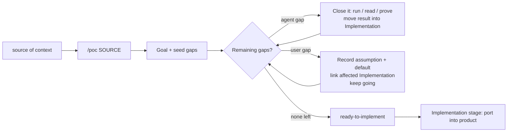

# POC Driven Development (POCDD)

> **What this is:** A methodology for building complex product features with AI
> agents. For each feature you create **one self-contained file** in `.pocs/` that
> *owns all the context* for that feature. Agents (Cursor, Claude, Copilot, …)
> iterate on that single file — closing gaps until the idea is fully shaped — and
> only then is the proven result implemented into the product.
>
> The file is, at the same time, the **prompt**, the **spec**, and the **handoff**.

**Related:** [`docs/technical/AI_AGENT_COLLAB.md`](docs/technical/AI_AGENT_COLLAB.md) (coordination primitives).

> This document describes the **methodology and its philosophy** — not any one
> feature. Examples use generic placeholders (`<feature>`, `<provider>`,
> `<DomainModel>`). Track live POCs wherever your team tracks work
> (issues), not in this methodology doc.

---

## TL;DR

1. **One feature, one file** in `.pocs/` that owns *all* the context for that feature.
2. The file has exactly three sections: **Goal**, **Implementation**, **Remaining gaps**.
3. **Bootstrap from any source** — a sentence, a task, a document, a URL: `/poc SOURCE`.
4. **Close gaps in a loop.** The agent closes what it can prove by itself; decisions
   it can't make become *gaps for the user* — it never stops execution to ask.
5. **Done = no remaining gaps.** The file flips to `ready-to-implement`.
6. **Implementation stage** — an agent ports the proven `Implementation` section into the product.

**The gap list is the progress bar. The same file is the prompt, the spec, and the handoff.**

---

## Philosophy

POCDD rests on a single conviction: **for an AI agent, context is the scarce
resource, and a feature is best owned by one bounded artifact.**

Complex features fail in AI-assisted development for three predictable reasons,
and the single-file model is the direct answer to each:

| Failure mode | What goes wrong | How POCDD answers it |
|--------------|-----------------|----------------------|
| **Context overload** | The agent loads many repos, legacy patterns, and half-formed requirements into one session. Quality drops; hallucinations rise. | **One file owns the feature's brain.** The agent reads one artifact to get oriented, then opens only the few paths a given step needs. |
| **Big-bang integration** | Logic is written straight into the framework before anyone has run the external API or settled the product rules. Rework is expensive. | The file is **shaped and proven first** — gaps closed, behavior demonstrated — before any production wiring. |
| **Lost understanding** | The team ships code nobody can explain because the decisions lived in chat. | **Every decision lives in the file.** When chat history is gone, the file still explains *why*. |

The trade is a short upfront investment in *shaping the file* for **incremental,
inspectable trust**: at any moment you can read what is proven, what is decided,
and what is still open — in one place, without booting the full stack.

---

## The core artifact: one self-contained file per feature

Everything in POCDD revolves around a single file living under `.pocs/` at the
repo root (a sibling to the production sub-repos — never inside one of them).
**`.pocs/` is gitignored in its entirety** — POC files are per-developer working
state, not committed source (the durable record is this methodology plus whatever
graduates into `docs/` and the product). This mirrors DeepWorkPlan's `.dwp/`.

**Rules of the artifact:**

- **One feature = one file.** If the file starts to balloon, that is the signal
  the "feature" is actually several — split it into multiple `.pocs/` files. Crisp
  feature scoping is what keeps the single-file model viable.
- **It owns the brain, not copies of the code.** The file owns goals, findings,
  decisions, the contract, and the imperative "what to do." It **references the
  codebase by path** (`repositories/api-services/.../models.py:120`) — it does
  *not* paste production code into itself. It points; the agent opens the path
  when a step needs it. This is what keeps the file bounded no matter how large
  the feature is.
- **It is self-bootstrapping and tool-agnostic.** A fresh agent — in Cursor,
  Claude, or Copilot, with no chat history — can open the file and know the goal,
  what is proven, what is blocked, and what to do next.
- **Secrets stay out.** Tokens and credentials live under gitignored `.pocs/`
  paths; prefer sandbox/test accounts and short-lived, least-scope tokens — never
  paste production secrets into the file.

### Choosing the file format (it follows the risk)

The format is not arbitrary — it decides whether you get **executable truth**:

| The feature's hard part is… | Use | Because |
|------------------------------|-----|---------|
| **Unknown external/runtime behavior** (an API, OAuth, sync math, time zones) | a **runnable** file (`.py` / `.js`): a rich, structured header that *is* the spec + a runnable body that *is* the proof | You can demonstrate behavior for real instead of reasoning about it. |
| **Internal/domain complexity** (a refactor, cross-module wiring, product rules) | a **`.md`** file | There is no runtime to prove; the value is the reasoned design. |

Either way the file is single and self-contained — you are only choosing whether
"proof" means *runnable* or *reasoned*.

---

## The three sections every POCDD file has

Every POCDD file — whatever its format — is organized into exactly three sections.
This fixed skeleton is what lets *any* agent know where to find things.

### 1. Goal

What we are trying to achieve, captured from **any source of context**: a one-line
sentence, an integration task, a linked document, a provider URL. The goal is the
fixed target the loop drives toward. (Bootstrapped with `/poc SOURCE` — see [Commands](#commands).)

### 2. Implementation

The **proven, worked-out solution design** — it grows as gaps close. Each entry
should be readable in two clearly separated registers:

- **Findings** — past tense, evidence-backed, each tagged with provenance:
  `[ran it]`, `[code: path:line]`, `[product decision]`, or `[assumption — unverified]`.
  This is what makes the file *trustworthy*: the agent can tell proven fact from guess.
- **Directives** — imperative "what to do," each with a **verifiable done-check**
  (a command, a test, a diff against the POC's own output). "Strong what to do"
  means *unambiguous and checkable*, not exhaustive line-by-line: **prescriptive
  on interfaces and acceptance, loose on implementation.**

> **Naming note:** *Implementation* (the section) is the proven solution design.
> The *implementation stage* (below) is the act of porting it into the product.
> The section is the blueprint; the stage consumes it.

### 3. Remaining gaps

The worklist — and the progress bar. **The POC is done when this section is empty.**
The quality of a POCDD file is bounded by the quality of its gap list, so gaps are
not just "what we noticed" — they are deliberately *discovered* (see below).

---

## The loop



### Gaps are typed by *who can close them*

This distinction is what makes "done = no gaps" actually mean something:

| Gap type | Owner | Behavior |
|----------|-------|----------|
| **Investigation gap** | `[agent]` | The agent closes it **itself** — run the API, read the code, diff the output. Close these aggressively and autonomously. |
| **Decision gap** | `[user]` | Only a human can resolve it (product trade-offs, priorities, "what should happen when…"). |

The agent can drive `[agent]` gaps to zero on its own, but **true "done" requires
that the `[user]` gaps are resolved too**. The intermediate state — *"all
investigation done, N decisions awaiting you"* — is exactly when the file surfaces
the decision list for a batch answer.

### Decisions become gaps — they never stop execution

When the agent hits a fork only the user can settle, it does **not** stop and wait.
It registers a **decision gap** and keeps working. To make "keep going" *safe*:

1. It picks and records a **default assumption** to proceed with.
2. It **links** the work that depends on it
   (e.g. *"`Implementation §4` assumes `Gap G3 = sync hourly`"*).

So when you later resolve `G3` differently, every affected section is flagged for
revision automatically. Without this link, continuing past a decision creates
*silent rework*; with it, continuing is traceable and reversible.

### Closing a gap *moves knowledge into Implementation*

The loop is a transfer: a closed gap leaves **Remaining gaps** and its proven
result lands in **Implementation** (with provenance). Resolving a `[user]` gap may
also **spawn new gaps** — the worklist is alive until it is empty.

### Discovering gaps is the hard part

An agent will happily close the obvious gaps and declare victory while never having
considered rate limits, token refresh, partial failures, pagination, or time zones.
So the bootstrap step's main job is **not** writing the Goal — it is **enumerating
the gaps you didn't know you had**, including a standard **failure-mode sweep** for
anything touching an external system. *Goal → "everything that must be proven,
decided, or handled to reach it."* That seeding is where most of the value lives.

---

## Definition of done (and the not-viable outcome)

A POCDD file carries a small status at the top — `phase: spike | shaping | ready-to-implement`.

- **Done / `ready-to-implement`** = **Remaining gaps is empty**: no `[agent]` gaps
  left to prove and no `[user]` gaps left to decide. The file is now the single,
  self-contained input to the implementation stage.
- **Not viable** is a first-class outcome. If closing a gap reveals the goal is
  infeasible or too costly, the POC concludes *negatively* — record the finding
  that killed it. A disproven idea, cheaply, is a success of the method, not a failure.

---

## The implementation stage

When the file is `ready-to-implement`, an agent ports the **Implementation** section
into the product. Because Implementation already separates findings from directives
and each directive carries an acceptance check, the porting agent executes against a
fence it can verify:

- **Lift datatypes and pure functions first** (the `<DomainModel>`, filter helpers,
  sync-plan computation) into the appropriate production package.
- **Wrap with framework boundaries** — views, permissions, feature flags.
- **Mirror proven behavior** — each production capability maps to a finding or a
  documented intentional difference.
- **UI last** — it consumes the stabilized contract.

If the file was **runnable**, keep it afterward as a **parity oracle / regression
harness** ("did the provider change its JSON shape?"). Archive or retire it once
integration tests fully cover its signal, or if security policy forbids standalone
credentials under `.pocs/`.

---

## Commands

POCDD is driven by a small `/poc` command surface. Each command maps to a point in
the lifecycle; the methodology above is the contract these commands implement.
(The command *implementations* are a separate artifact — this section defines the
surface and its behavior.)

```
/poc SOURCE → [ /poc work : close gaps in a loop ] → /poc implement → /poc archive | /poc remove
```

| Command | Lifecycle role | Behavior |
|---------|----------------|----------|
| `/poc SOURCE` | **Create** | Bootstrap a new POC file from any source (a sentence, an issue, a document, a URL). Picks the file format by risk (`.md` / `.js` / `.py` / …), writes the **Goal**, and seeds **Remaining gaps** — including a failure-mode sweep for anything touching an external system. |
| `/poc list` | **Read (all)** | List every POC in `.pocs/` with its `phase` and gap counts (split by `[agent]` / `[user]`). |
| `/poc status <name>` | **Read (one)** | Detailed status of a single POC: phase, findings, and remaining gaps by owner, plus what is currently blocking. |
| `/poc work <name>` | **Shape (the engine)** | Run the gap-closing loop: close `[agent]` gaps autonomously (run / read / prove), move proven results into **Implementation**, and record `[user]` decision gaps with a default assumption + links — never stopping execution. Advances the file toward `ready-to-implement`. |
| `/poc implement <name>` | **Implementation stage** | Port a `ready-to-implement` POC's **Implementation** section into the product, executing each directive against its acceptance check. |
| `/poc archive <name>` | **Retain** | Move a done POC out of the active set but keep it as a parity / regression oracle. |
| `/poc remove <name>` | **Delete (one)** | Delete a single POC file. |
| `/poc clear` | **Delete (all)** | Wipe the `.pocs/` directory. |

**Parsing rule:** the reserved subcommands — `list`, `status`, `work`, `implement`,
`archive`, `remove`, `clear` — always take precedence. Anything else after `/poc`
is treated as a **SOURCE** for creation (e.g. `/poc "add holidays sync"`).

---

## Design decisions (the backbone)

Every load-bearing decision behind POCDD, recorded so the methodology stays coherent:

| # | Decision | Rationale |
|---|----------|-----------|
| 1 | **One self-contained file per feature**, in `.pocs/`. | Context is the scarce resource; a feature is best owned by one bounded artifact that doubles as prompt, spec, and handoff. |
| 2 | **The file owns the brain, references the codebase by path.** | Keeps the artifact bounded for any feature size; preserves "read one file, then open only what a step needs." |
| 3 | **Format follows the risk** — runnable when behavior is unknown, `.md` when complexity is internal. | Executable truth is the thing that de-risks integrations; don't pay for a runnable spike when there's no runtime to prove. |
| 4 | **Fixed three-section skeleton:** Goal / Implementation / Remaining gaps. | A predictable structure makes the file tool-agnostic — any agent knows where to look. |
| 5 | **Two registers inside Implementation:** findings (with provenance) vs directives (with acceptance checks). | The agent must distinguish proven fact from assumption, or it builds on guesses. |
| 6 | **"Strong what to do" = unambiguous + verifiable, not exhaustive.** Prescriptive on interfaces/acceptance, loose on implementation. | Over-prescription shatters when reality differs; an acceptance check makes a loose directive safe. |
| 7 | **Gaps are typed by owner** (`[agent]` investigation vs `[user]` decision). | "Done = no gaps" is only meaningful if you separate what the agent can close from what needs a human. |
| 8 | **Decisions become gaps; execution never stops.** The agent records a default assumption and links affected work. | Keeps the agent flowing and batches human input — while making "continue past a decision" traceable, not silent rework. |
| 9 | **Gap discovery (incl. a failure-mode sweep) is the bootstrap's main job.** | A POCDD file is only as good as its gap list; the obvious gaps aren't the dangerous ones. |
| 10 | **Done = empty gap list; "not viable" is a valid done.** | The progress bar is objective, and disproving an idea cheaply is a win. |
| 11 | **A small `/poc` command surface** drives the lifecycle; reserved subcommands take precedence over a free-form SOURCE. | One verb per lifecycle point keeps the method operable across tools (Cursor, Claude, Copilot) without ambiguity between subcommands and sources. |

---

## When to use POCDD

**Good fit:**

- New external integration (calendar, holidays API, billing provider, …).
- Cross-repo features (API + frontend + background jobs).
- Domain logic that is easy to get wrong (sync diffs, time zones, exclusions).
- Product still answering "what should happen when…?" while engineering explores "can we?".

**Skip or shorten:**

- Single-file bug fix or copy change.
- A feature that mirrors an existing pattern with no new provider.
- A pure UI tweak with no new backend behavior.

When unsure, still start a file with just the **Goal** and a seeded gap list — if the
gaps close cheaply, you were right to; if they multiply, you've learned the feature
is bigger than it looked.

---

## Relationship to other practices

| Practice | Overlap | Difference |
|----------|---------|------------|
| **Spike / tracer bullet** | Bootstrapping the file | POCDD keeps the spike as a **living, owned artifact** that is shaped to done, not thrown away. |
| **TDD** | Acceptance checks on directives | POCDD front-loads **integration truth** in one artifact before unit tests in the framework. |
| **ADRs (decision records)** | Decisions live in the file | POCDD records decisions *inline with the work they gate*, and links downstream effects via assumptions. |
| **Execution frameworks / planners** | The implementation stage | Complementary: POCDD defines *what to prove and decide* so the resulting plan is well-formed. POCDD works with or without one. |
| **ATDD / E2E** | Post-implementation validation | E2E validates shipped UX; the POCDD file validates **provider + domain truth** far earlier. |

---

## Team conventions

- **Name files by domain** (e.g. `.pocs/<domain>.py` or `.pocs/<domain>.md`) — never `test.py`.
- **One feature per file.** If it balloons, split it.
- **Reference the file** in the tracking issue and in the first implementation task.
- **Track live POC status** where the team tracks work (issues), not in this methodology doc — `.pocs/` is gitignored and not a status board.
- **Report progress** at meaningful boundaries (file bootstrapped, decisions resolved,
  `ready-to-implement`, ported) — same human-first standup style as code commits.

---

## Open questions (methodology)

Meta-items to refine as we run more POCDD features:

- What is the right *shape* of the `/poc SOURCE` bootstrap — how aggressively
  should it seed gaps, and from which sources (issue, doc, URL, raw prompt)?
- A standard parity-test pattern that imports a runnable file's pure functions to
  guard against drift after the implementation stage?
- A Cursor rule / skill that auto-suggests POCDD when an issue is labeled `investigation`?

Contributions welcome — edit this doc when a new feature validates or contradicts a rule above.
